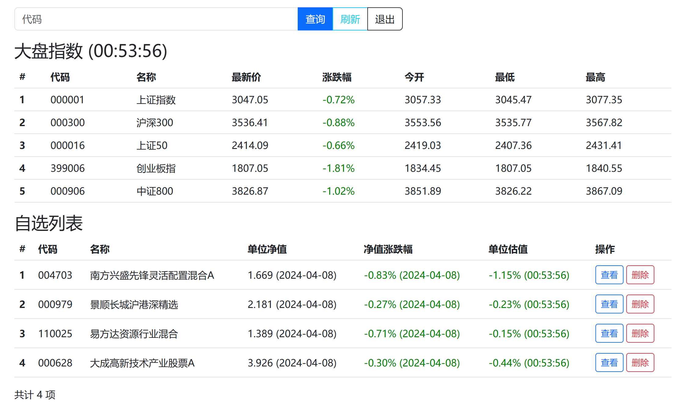
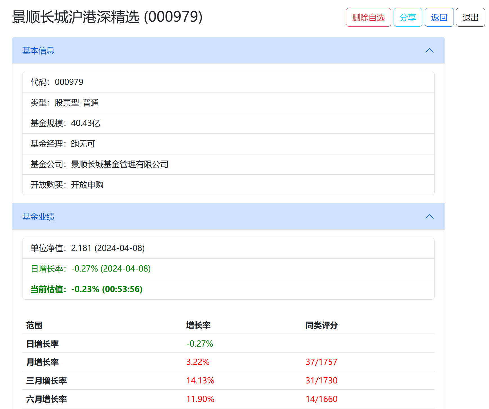
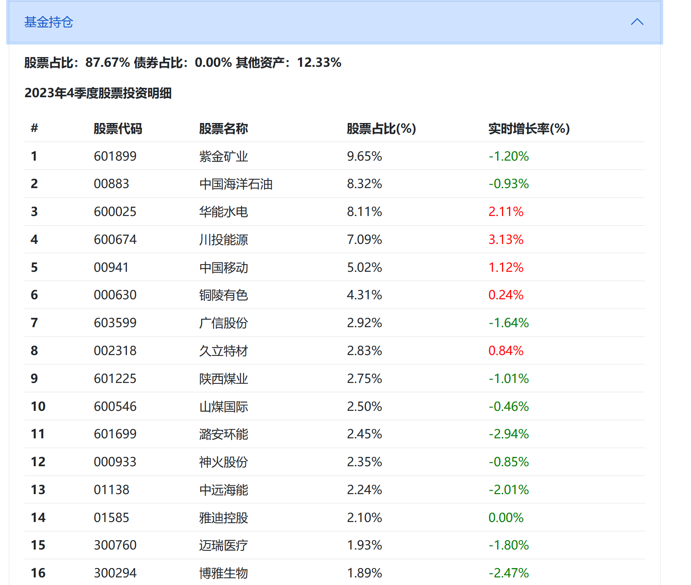

# Fundviewer (version 2)

这个世界不能没有“基金估值”。一个保留基金估值功能的自选基金看板。支持自选基金列表、基金详情分享、基金实时估值等功能。

本版本采用 fastapi + async akshare 构建，极大提升了并发能力和数据处理速度。

### Usage

```docker-compose up -d```


### Configuration

可以通过环境变量配置以下参数：

| 参数名 | 默认值 | 说明 |
|--------|--------|------|
| `MAX_FAVOUR` | 100 | 用户可关注的最大基金数量 |
| `MAX_CONCURRENT_REQUESTS` | 3 | 向外部API发起的最大并发请求数，降低此值可避免被限流 |
| `REQUEST_DELAY_MS` | 100 | 每个请求批次之间的延迟时间（毫秒），增加延迟可进一步降低请求频率 |

如果你有大量自选基金（如100只），建议适当降低 `MAX_CONCURRENT_REQUESTS` 或增加 `REQUEST_DELAY_MS` 以避免被API提供商限流或封禁。

### Demonstration




